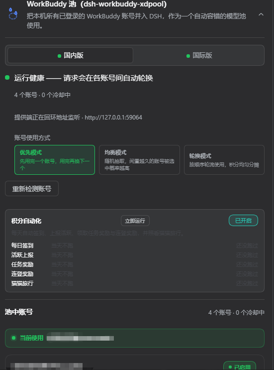
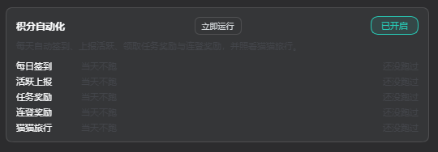
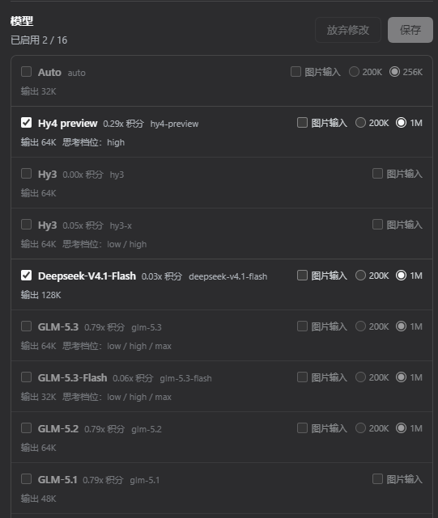
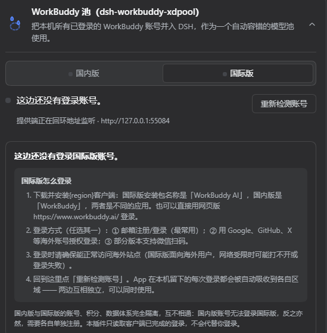

# DSH WorkBuddy XD Pool

<p align="center">
  <a href="https://www.npmjs.com/package/dsh-workbuddy-xdpool"></a>
  <a href="https://www.npmjs.com/package/dsh-workbuddy-xdpool"></a>
  <a href="LICENSE"></a>
  <a href="https://github.com/XDTrees/dsh-workbuddy-xdpool/stargazers"></a>
</p>

[English](./README.en.md) | 中文

把 WorkBuddy 桌面 App 里登录过的**所有账号**，合成一个 DSH 模型池。你在 WorkBuddy 里登过几个号，池里就有几个号——不用手动填表，不用一个个录入。

哪个号被限流了、积分用光了，请求自动换到下一个能用的号上去。你只管问，剩下的它自己处理。

**另外附送一整套「积分自动化」**：签到、领任务奖励、连登兑换、开猫猫旅行……这些每天都要手动点一遍的活儿，插件在后台替你干完了。

> **和单账号连接插件的区别**：`dsh-workbuddy-connect` 那类插件是「一次一个账号」。XD Pool 把**多账号当默认情况**——不挑号、不手动导入，本机 WorkBuddy 所有历史登录快照全部收进一个共享池，对外用一个 `workbuddy-xdpool` provider 分组，池内自动容错。

## 先看几张图

**插件配置卡片（设置 → 插件 → DSH WorkBuddy XD Pool）**



**积分自动化面板**



**模型选择器（国内版 / 国际版 两个独立分组）**



**国内版 / 国际版 双供应商（各自独立账号、积分与模型，可同时使用）**



## 功能

### 一、多账号池

- **零配置**：装上、打开，就完事了。WorkBuddy 桌面 App 里每个登过的账号都会被自动发现并入池，不需要在插件里录任何东西。

- **自动容错换号**：池子记着每个账号的限流状态。某个号触发 429 就冷却它，后面的请求自动落到下一个健康的号上；冷却结束自动恢复。所有号都在冷却时，请求才排队等待。

- **池健康一眼看清**：卡片显示「几个账号 / 几个在冷却」「下一个会轮到谁」，以及每个账号的令牌有效期和冷却倒计时。

- **剩余积分实时可见**：按账号列出积分包（`套餐名 · 剩余 / 总量`）和大字合计，跟着上游实时刷新。

- **模型目录带标注**：列出池里能用的模型，附带积分倍率（如 `GLM-5.2 · x0.79`）、免费 / 限时免费 / 夜间折扣标签、能否收图和上下文窗口大小，全部跟随上游实时更新。

- **国内版 / 国际版自动适配**：按账号凭据里的登录域名自动选上游——国际版登录（`workbuddy.ai`）走 `www.workbuddy.ai`，国内版（默认）走 `copilot.tencent.com`。两种账号可以混在同一个池里。

- **想手动做点啥也行**：卡片和命令行都提供「重新检测账号」「清除所有冷却」「每日签到」三个操作。

### 二、积分自动化

卡片上一个开关，插件在后台把你成长中心的日常动作全做掉。**默认全自动，也可以随时点「立即运行」手动跑一轮。**

它管这五件事：

| 任务 | 默认时间 | 干什么 |
| --- | --- | --- |
| 每日签到 | 09:00 | 领取当天签到奖励 |
| 活跃上报 | 10:00 | 报个到，让成长中心知道你还在用 |
| 任务奖励 | 11:00 | 把任务中心的奖励该报名的报名、该领的领掉 |
| 连登奖励 | 12:00 | 连登档位兑换 + 抽奖 |
| 猫猫旅行 | 09:00 · 21:00 | 把猫派出去、回来领奖励 |

**「任务奖励」这一项覆盖了 13 个任务**，包括那些看起来非得本人坐在电脑前点鼠标才能完成的：

> 探索优秀灵感 · 使用 5 个模板 · 尝鲜热门技能 · 换「和平精英」主题 · 逛资料库 · 召唤 5 次专家 · 召唤 3 次专家团 · 体验腾讯轻量云专家 · 进入任一小助手应用 · 进入企鹅教师助手 · 设计创意模式建画布 · 创建定时任务 · 猫猫对话

实测一轮跑下来，四个账号合计领到 **3300 积分 + 135 能量**。

**卡片上会告诉你这一轮具体领到了什么**——不是只写「领了 8 个任务」，而是把任务名字列出来。连登还差几天解锁也会写清楚（比如「还差 4 天解锁 7 天档」），免得你以为是坏了。

**关于「今日收益」**：卡片按来源分四行显示——任务奖励、签到、连登、旅行。今天赚了多少一眼看到，跨天自动清零。

**关于保留积分**：可以给每个账号设一个积分下限，余额低于这个数的账号就不派活了，省着点用。

> **国际版不显示这个面板**——那边的网关压根没有积分系统。

## 安装

前置条件：装好 WorkBuddy 桌面 App 并登录（插件复用它存在本机的登录状态）。多账号 = 在桌面 App 里换着登几次，每次登录都会被自动吸进池里。已针对 DSH Desktop host `0.1.2` 适配。

> 兼容 host `0.1.1-rc.2` / `0.1.2` 系列：安装设置节时会按 host 能力自动选择 `settings.installSection`（0.1.2-rc.1+）或更早的自由函数写法。

**方式一：从 npm 安装（推荐）**

```sh
# dsh 不在 PATH 时，用 node ~/.dsh/profiles/node_modules/@deepseek-ai/dsh/lib/bin.js 代替 dsh
dsh plugin --profile desktop add dsh-workbuddy-xdpool
```

> 推荐 npm：需要拉取的依赖只有插件自己（**约 1 个包，几秒搞定**）。
> 从 GitHub 源码装会连带装开发依赖（构建器、测试框架等几百个包），慢得多。

**方式二：从 GitHub 源码安装**

```sh
dsh plugin --profile desktop add github:XDTrees/dsh-workbuddy-xdpool
```

**方式三：手动注册 bundle**

```sh
# 1) 先装包（npm 或 GitHub 任选）
dsh plugin --profile desktop add dsh-workbuddy-xdpool

# 2) 注册 bundle：编辑 ~/.dsh/profiles/desktop/package.json，
#    在 "dsh" → "profile" → "bundles" 数组末尾加上 "dsh-workbuddy-xdpool"

# 3) 重启 DSH Desktop
```

**本地构建（开发者）**

```sh
pnpm install
pnpm build              # 产出 lib/index.js + lib/index.d.ts + lib/bin.js + lib/client.js
pnpm test               # 138 项测试
pnpm typecheck          # 宿主侧类型检查
pnpm typecheck:client   # 客户端类型检查
```

> **构建产物已随仓库提交**（`lib/` 不在 gitignore 里），所以从 GitHub 装不需要任何安装期脚本，也不会弹 pnpm 那句「构建脚本被拦截，请放行」。**改了 `src/` 记得重新 `pnpm build` 并把 `lib/` 一起提交**，否则用户拿到的是旧产物。

> 注意：`pnpm install` 要用 pnpm 11（`npx pnpm@11`），必要时加 `--config.confirmModulesPurge=false --config.minimumReleaseAge=0`——pnpm 11 默认的 `minimumReleaseAge` 供应链年龄策略会拦下刚发布的 rc 包。

装完以后：模型选择器里会出现 **WorkBuddy XD Pool** 分组；设置 → 插件 → **DSH WorkBuddy XD Pool** 能看池健康、各账号的令牌 / 积分 / 签到 / 冷却状态，还有「重新检测账号」「清除所有冷却」按钮和每个账号的签到按钮。

Web / TUI profile 也能用（`--profile web` / `--profile dsh-tui`）。

## 命令行

统一用 `dsh plugin --profile desktop exec dsh-workbuddy-xdpool <子命令>` 调用：

```sh
dsh plugin --profile desktop exec dsh-workbuddy-xdpool status    # 池里几个号 / 几个冷却 + shim 状态（--credits 查积分、--json 机器可读、--rates 看倍率）
dsh plugin --profile desktop exec dsh-workbuddy-xdpool accounts  # 已发现的账号（--json）
dsh plugin --profile desktop exec dsh-workbuddy-xdpool doctor    # 诊断发现 / 冷却 / 上游连通性
dsh plugin --profile desktop exec dsh-workbuddy-xdpool reset     # 立刻清掉所有 429 冷却
dsh plugin --profile desktop exec dsh-workbuddy-xdpool checkin   # 查每个账号今天签到了没（--json 机器可读）
dsh plugin --profile desktop exec dsh-workbuddy-xdpool checkin all
                                                                 # 领掉所有账号今天的签到奖励；也可以只传一个账号标签领单个
dsh plugin --profile desktop exec dsh-workbuddy-xdpool login     # 教你怎么在桌面再加一个号进池
```

## 池里怎么多账号？

池子走**自动发现**：WorkBuddy 桌面 App 每次登录都会在本机留一个带令牌的历史快照，XD Pool 扫描这些快照，把每个账号都收进池。所以多账号 = 在桌面 App 里换着登几次，之后点卡片上的「重新检测账号」或者重启 DSH，新号就自动进池了。

如果你想给桌面 App 之外的一次登录做个**显式快照**（比如临时固定某个号做验证），也可以手动导入：

```sh
# 在 WorkBuddy 桌面 App 登录账号后（key 自己起名）：
dsh plugin --profile desktop exec dsh-workbuddy-xdpool import myKey
# 查看 / 删除已导入的快照：
dsh plugin --profile desktop exec dsh-workbuddy-xdpool accounts
dsh plugin --profile desktop exec dsh-workbuddy-xdpool remove myKey
```

导入的快照以 key 的 **MD5 前 8 位**命名，放在 `~/.dsh/.workbuddy-xdpool/`（key 本身记在文件里），中文、带 `/`、带空格的 key 都安全。长期使用靠 refresh token 自动续期；失效了就回桌面重新登录，再 `import <key> --force` 覆盖。

## 配置

池的配置走插件设置节（`settings.workbuddy-xdpool`），模型设置页里能改，改完立即生效：

| 字段 | 说明 | 默认 |
| --- | --- | --- |
| `authFile` | 覆盖 WorkBuddy 桌面 auth 文件路径（跨平台自动探测出问题时用，等同于 `WORKBUDDY_AUTH_FILE`） | 自动探测 |
| `cooldownMs` | 单账号 429 冷却时长（毫秒） | `60000` |

也可以直接写进 `~/.dsh/settings.yaml`：

```yaml
workbuddy-xdpool:
  cooldownMs: 120000
```

## 架构

- **宿主侧**（`src/`，跑在 DSH 主进程里）
  - `index.ts` —— 注册 `workbuddy-xdpool` provider、`workbuddy-xdpool` 设置节、各条同源路由（状态 / 重新检测 / 清除冷却 / 签到 / 自动化运行 / 保留积分），以及账号发现与模型目录播种。
  - `accounts.ts` —— `WorkBuddyAccountPool`：读本机 WorkBuddy 桌面 auth 快照、429 冷却、轮换与 token 刷新；账号停用与积分保留也在这里。
  - `scheduler.ts` —— 积分自动化的调度器：按本地时点跑五个任务（签到 / 上报 / 任务 / 连登 / 旅行），每日收益账本落盘，手动「立即运行」走的是同一套逻辑。
  - `task-events.ts` —— 13 条任务事件链的构造。每条链都是纯数据，外加它该走哪个指纹通道（桌面 / 网页）；需要真实会话的任务（技能、专家）在这里先开一次真对话，拿到服务端 id。
  - `catalog.ts` / `upstream.ts` —— 上游模型目录（含每模型积分倍率、免费 / 图片能力标签）、积分查询、签到、自动化各接口的上游客户端（按凭据域名自动切国内外）。
  - `web-status.ts` / `status-paths.ts` —— 卡片读的同源状态文档与路由。写操作按「POST + 回环来源 + 显式 accountId」把关。
  - `bin.ts` —— 上面那套 CLI。
- **客户端**（`src/client/`，浏览器卡片，经 `dsh.client` 由宿主加载）
  折叠卡片外壳沿用宿主内置卡的 `dsm-plugin-card*` 样式语言（`--dsw-alias-*` 主题变量），内容类名统一 `dsm-workbuddy-xdpool-*` 前缀，不污染宿主其它卡片；文案命名空间 `settings.workbuddy-xdpool`。
- **构建**
  `tsdown` 产出 `lib/index.js`（宿主入口）+ `lib/index.d.ts`（类型）+ `lib/bin.js`（CLI）+ `lib/client.js`（CJS，用 `window.__ModuleLoader__.load` 包起来的浏览器 bundle）。四个产物都随仓库提交，所以安装时不需要任何构建脚本。

## 已知限制

- **只能用本机桌面 App 里的账号**：池不会、也没法替你发起 WorkBuddy 的登录或扫码（token 由 WorkBuddy 桌面 App 自己的腾讯 SSO 铸造并和设备绑定）。加号 = 在桌面 App 里登录 / 切换，XD Pool 自动吸收。

- **自动化里有几个任务刻意没做**
  - `Expert_Philanthropy`（公益专家）：需要真捐钱，绕不过去。
  - `black_cat`（夜猫子）：只在 23:00–08:00 计分，而且**没有积分奖励**——熬夜白熬。
  - `Model_chat_GLM5.2`（指定模型对话）与 `wb_wechat_oa_subscribe_task`（关注公众号）：路径已经摸清，留到下个版本。

- **`Expert_team_use_3` 偶发卡在 2/3**：有个号当天用掉两次专家团后，第三次怎么发都不涨（换个没用过的专家团也不涨）。怀疑该任务对单账号有当日额度、跨天恢复，但没验证。**新号不受影响**（实测 0/3 → 3/3）。

- **依赖 WorkBuddy 客户端接口**（不是官方开放 API），WorkBuddy 更新后插件可能得跟着调。某个账号的 refresh token 失效时，回桌面重新登录即可。

- 如果 Windows 和 Linux 用户名不同、且 Windows 环境变量没传进 WSL，请用 `WORKBUDDY_AUTH_FILE` 或配置里的 `authFile` 指定实际位置。

## 免责声明

- 本项目**仅供个人学习和研究使用**，仅驱动使用者自己的 WorkBuddy 账号在本机调用，请勿用于商业用途或超出个人合理使用的场景。
- 使用者需遵守 WorkBuddy 的服务条款；因使用本项目产生的任何后果（包括但不限于账号被限制、额度被清空、服务中断），由使用者自行承担。
- 本项目作者不对任何因使用或滥用本项目产生的直接或间接损失负责。
- 本项目与腾讯、WorkBuddy、DeepSeek 均无关联，未获其授权或认可；文中出现的名称仅用于描述兼容关系，其商标权利归各自所有。

## 致谢

本项目的实现参考了以下已公开的项目，并按其许可证要求保留版权声明。参考方向为**设计思路与既有结论**，代码为独立实现；关键模块在源文件头部注释中也标注了所参考的项目与模式：

- [corrinehu/dsh-workbuddy-connect](https://github.com/corrinehu/dsh-workbuddy-connect)（MIT）—— 设置节注册（`settings.installSection`）与 DSH 插件结构、客户端卡片加载机制、桌面端凭据刷新与 loopback shim 加固的核心参照；本项目沿用其「宿主通过 installSection 挂卡片」的打通路径。
- [dingminhua/dsh-connect-workbuddy](https://github.com/dingminhua/dsh-connect-workbuddy)（MIT，Copyright (c) 2026 LaoDing）—— `dsm-plugin-card*` 卡片样式语言与 `--dsw-alias-*` 主题变量的参照实现；**每日签到**（`/v2/billing/meter/checkin-activity-status` 与 `/v2/billing/meter/daily-checkin`）、积分包聚合口径（月度周期套餐 / 一次性礼包区分）与国内 / 国际版按 `domain` 选择上游域名的做法，参考了该项目已验证的接口形态。
- [Sliverkiss/workbuddy2api](https://github.com/Sliverkiss/workbuddy2api)（MIT）—— WorkBuddy 上游协议（`copilot.tencent.com` 的 wire behavior）与积分接口的参照实现；**积分自动化**（成长中心签到 / 活跃上报 / 连登兑换 / 猫猫旅行状态机 / 13 条任务事件链 / 专家召唤链）整体照该项目的 Go 版逆向实现移植，每条事件链的判据与实测结论都来自它。

以上项目的版权归各自作者所有。本项目采用**参考设计思路 + 独立实现**的方式，未整体复制任何参考项目的源码。若标注有遗漏或不当之处，欢迎提交 issue 指正。

## 许可证

[MIT](./LICENSE)
